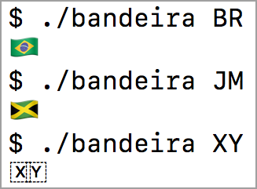

# Emojis de bandeiras

Este diretório contém programas para exibir bandeiras usando os caracteres Unicode da faixa RIS — [REGIONAL INDICATOR SYMBOL](https://runefinder2018.appspot.com/?q=regional+indicator+symbol) de A até Z (U+1F1E6...U+1F1FF).

## Como funciona

Alguns navegadores, aplicativos de celular e terminais exibem um emoji de bandeira quando encontram um par de caracteres da faixa RIS que corresponde a um código na norma [ISO 3166-1 alpha-2](https://en.wikipedia.org/wiki/ISO_3166-1_alpha-2)

Por exemplo, este par...

- U+1F1E7: REGIONAL INDICATOR SYMBOL LETTER B
- U+1F1F7: REGIONAL INDICATOR SYMBOL LETTER R

...produz o emoji da bandeira do Brasil 🇧🇷.

Pesquisando em setembro de 2018, não encontrei nenhum terminal no GNU/Linux ou no Windows que exiba as bandeiras. Mas no terminal do Mac OS X 10.13, funciona assim:

Se a combinação não corresponde a um código [ISO 3166-1 alpha-2](https://en.wikipedia.org/wiki/ISO_3166-1_alpha-2)
, o terminal exibe um símbolo para cada letra.